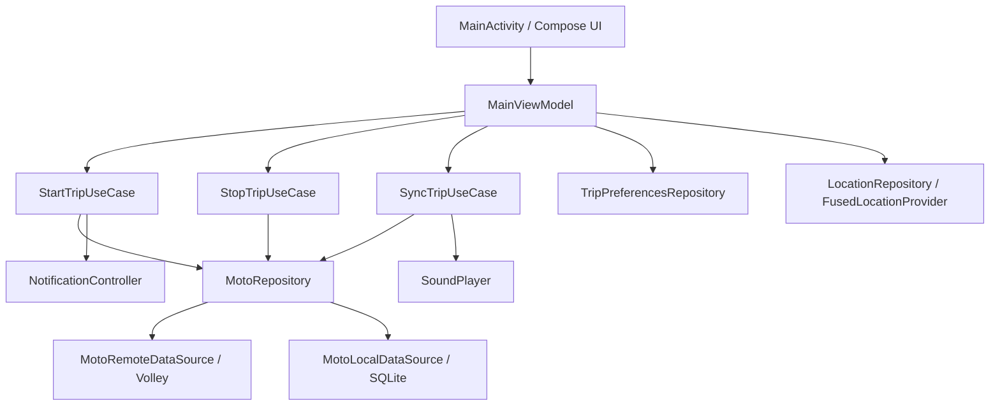

# Этап 2. Рефакторинг мобильного приложения MotoTrack

## Выполненные изменения

Исходное Android-приложение было переписано с Java на Kotlin. Экранная часть перенесена с XML-разметки, `Activity` и `Fragment` на Jetpack Compose. Основной экран теперь реализован в `MainActivity.kt`, состояние экрана хранится во `ViewModel`, а бизнес-логика вынесена из UI в use case-классы.

Проект разделен на слои clean architecture:

- `domain` содержит модели, интерфейсы репозиториев, сервисы и use case-классы;
- `data` содержит реализации работы с сетью, SQLite, SharedPreferences, геолокацией, уведомлениями и звуком;
- `presentation` содержит `MainViewModel`, состояние UI и адаптер для Yandex MapKit;
- `di` содержит Hilt-модуль для внедрения зависимостей.

## Примененные принципы современной разработки

### Jetpack Compose

Интерфейс построен декларативно: состояние `MainUiState` передается в composable-функции, а пользовательские действия возвращаются во `ViewModel` через callback-функции. Старые XML layout-файлы удалены, так как больше не участвуют в построении UI.

### MVVM

`MainActivity` отвечает только за инициализацию Android-компонентов и отображение Compose UI. `MainViewModel` хранит состояние экрана, запускает синхронизацию поездки, обрабатывает ввод адреса, выбор режима, уведомлений и звука.

### Clean Architecture

Зависимости направлены от внешних слоев к внутренним:

- UI зависит от `ViewModel`;
- `ViewModel` зависит от use case-классов и интерфейсов репозиториев;
- реализации сети, базы данных и Android API находятся в `data`;
- `domain` не зависит от Android UI.

### SOLID

Принцип единственной ответственности соблюден разделением классов: `DistanceCalculator` считает расстояние, `StartTripUseCase` запускает поездку, `StopTripUseCase` завершает поездку, `SyncTripUseCase` синхронизирует активную поездку. Принцип инверсии зависимостей реализован через интерфейсы `MotoRepository`, `TripPreferencesRepository`, `LocationRepository`, `NotificationController`, `SoundPlayer`.

### Dependency Injection

Для DI используется Hilt. Класс `MotoTrackApplication` помечен `@HiltAndroidApp`, `MainActivity` помечен `@AndroidEntryPoint`, зависимости связываются в `AppModule`.

### Тестирование

Добавлены unit-тесты для доменной логики:

- `DistanceCalculatorTest`;
- `ValidateTripSettingsUseCaseTest`.

Добавлен Compose UI test `MotoTrackAppTest`, проверяющий отображение основных элементов экрана настроек.

## UML-диаграмма компонентов

## Использованные источники

- Android Developers. Jetpack Compose documentation.
- Android Developers. Guide to app architecture.
- Android Developers. ViewModel overview.
- Android Developers. Dependency injection with Hilt.
- Android Developers. Testing in Android.
- Yandex MapKit documentation.
